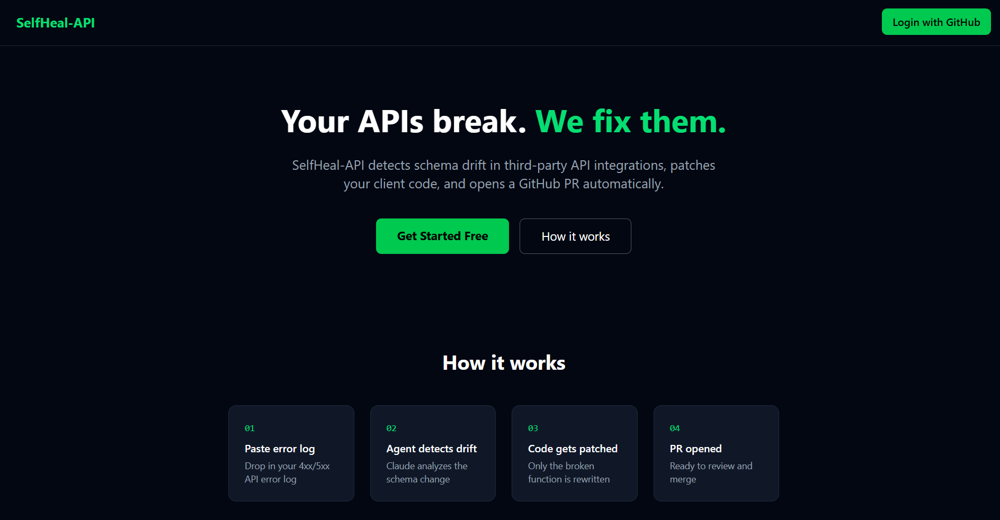
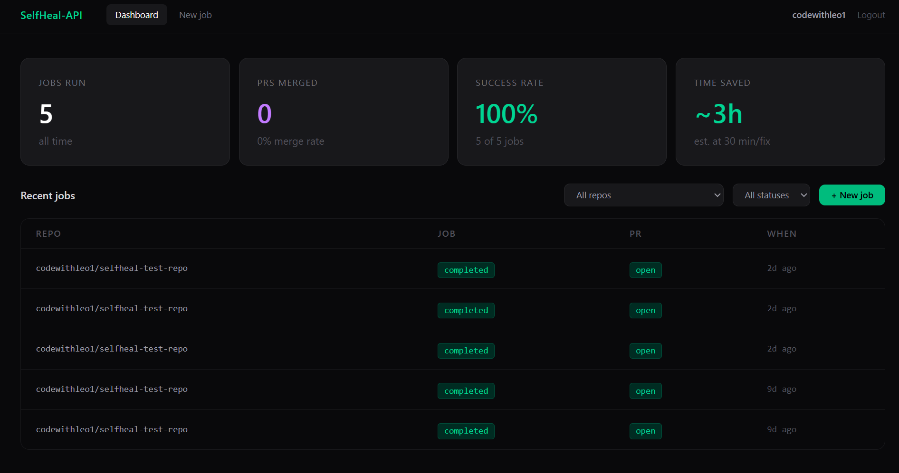
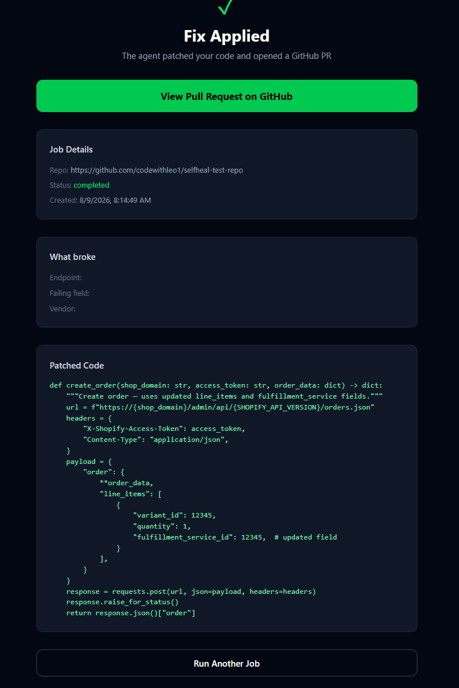

# SelfHeal-API

**Autonomous AI agent that detects API schema drift, patches your client code, and opens a GitHub PR — without human intervention.**

🔗 **Live Demo:** [self-heal-api.vercel.app](https://self-heal-api.vercel.app)

---

## Screenshots


### Landing Page


---

### Dashboard — Stats, Jobs Table, PR Status


---

### Job Result — Patched Code & PR Link


---

### Discord Notification on PR Open


---

---

## The Problem

Third-party APIs (Stripe, Twilio, Shopify) release breaking changes. Your integration breaks at 2am. An engineer spends hours tracking down which field was renamed, finding the right docs, rewriting the mapper, and opening a PR.

SelfHeal-API eliminates that entire loop — automatically.

---

## How It Works

```
User pastes error log  →  OR  →  Sentry webhook fires automatically
                ↓
Step 1 — Detect    → LLM analyzes the log, extracts endpoint + failing field
                ↓
Step 2 — Search    → GitHub Code Search locates the broken file and function
                ↓
Step 3 — Crawl     → Fetches vendor OpenAPI spec, identifies what changed
                ↓
Step 4 — Patch     → Rewrites the broken function with AST-validated code gen
                ↓
Step 5 — PR        → Opens a GitHub PR with full explanation + Discord alert
```

End-to-end in under 60 seconds. Zero human input required.

---

## Live Pipeline Proof

**PR opened and merged autonomously on August 10, 2026:**
- Job: `61c02ac4-5385-414e-8bba-95a311d1215c`
- PR: [codewithleo1/selfheal-test-repo/pull/17](https://github.com/codewithleo1/selfheal-test-repo/pull/17) — **MERGED**
- All 5 steps completed with zero human input

---

## Tech Stack

| Layer | Technology |
|---|---|
| Frontend | React 18, Vite, TailwindCSS |
| Backend | FastAPI, Python 3.12, uvicorn |
| Agent / LLM | Groq API (Llama 3.3 70B), dual-key rotation |
| Database | Supabase (PostgreSQL) |
| Job Queue | Upstash Redis |
| Auth | GitHub OAuth 2.0 |
| Notifications | Discord webhooks |
| Monitoring | Sentry (webhook trigger) |
| CI/CD | GitHub Actions (lint + test on every push) |
| Hosting | Vercel (frontend), Render (backend) |

100% free-tier infrastructure.

---

## Architecture

```
                    ┌─────────────────────┐
                    │   Sentry Webhook     │  ← auto-trigger on error
                    └────────┬────────────┘
                             │
Browser (Vercel)             │
      ↓ HTTPS                ↓
FastAPI Backend (Render) ←───┘
      ↓
  ┌─────────────────────────────────────────────┐
  │              Agent Pipeline                  │
  │  detect → search → crawl → patch → pr        │
  └─────────────────────────────────────────────┘
      ↓            ↓           ↓          ↓
  Groq API    GitHub API   Supabase   Discord
  (LLM)       (search +    (jobs +    (notify)
              PR create)    logs)
                  ↑
           Upstash Redis
           (job queue)
```

---

## Agent Pipeline — Detail

### Step 1 — Detect (`detect.py`)
Parses the raw error log using an LLM prompt. Returns structured JSON: endpoint, HTTP method, failing field, vendor name.

### Step 2 — Search (`search.py`)
Uses GitHub Code Search API to locate the broken file and function in the repo automatically. Falls back to direct repo file listing if the search index is stale. No manual file path needed.

### Step 3 — Crawl (`crawl.py`)
Fetches the vendor's public OpenAPI spec (Stripe, Twilio, Shopify). Uses jsondiff to compare old vs new schema. LLM summarizes the breaking change in plain English.

### Step 4 — Patch (`patch.py`)
Fetches the broken file from the user's GitHub repo. Prompts the LLM to rewrite only the failing function. Validates output with `ast.parse()` before proceeding.

### Step 5 — PR (`pr.py`)
Creates a new branch `selfheal/fix-{timestamp}`, pushes the patched file, opens a Pull Request with a structured description explaining what broke and how it was fixed. Fires a Discord notification on success.

---

## Autonomous Trigger — Sentry Webhook

Configure SelfHeal-API as a Sentry webhook to trigger healing with zero human input:

```
URL: https://selfheal-api.onrender.com/api/v1/webhooks/sentry?repo=https://github.com/your-org/your-repo
Events: issue created
```

When Sentry fires, the agent runs the full 5-step pipeline and opens a PR automatically.

---

## Key Engineering Decisions

See [ARCHITECTURE-DECISIONS.md](./ARCHITECTURE-DECISIONS.md) for the full ADR log. Highlights:

- **No LangChain** — custom 5-step linear pipeline is simpler, more debuggable, and easier for reviewers to understand
- **Groq over OpenAI** — free tier with 14,400 req/day; dual-key rotation handles rate limits automatically
- **Static analysis only** — patched code is never executed server-side; `ast.parse()` validates syntax without running anything
- **GitHub Code Search + fallback** — search index can lag on new files; direct contents API listing used as fallback
- **`/api/v1/` prefix from day one** — zero cost to add now, expensive to retrofit later
- **Sentry webhook `?repo=` query param** — simpler than maintaining a DB mapping of Sentry project → repo

---

## Security

See [SECURITY.md](./SECURITY.md) for the full threat model. Key points:

- GitHub tokens stored server-side only, never returned to the frontend
- Error logs validated via Pydantic before reaching the agent
- No arbitrary code execution — lint and syntax checks only
- CORS restricted to the configured frontend origin
- Sentry webhook signature verified via HMAC-SHA256

---

## Local Development

### Prerequisites
- Python 3.12+
- Node.js 18+
- `uv` package manager
- Supabase account (free)
- Groq API keys (free at console.groq.com)
- GitHub OAuth App
- GitHub classic token with `repo` scope

### Backend
```bash
cd backend
uv sync
cp ../.env.example .env
# Fill in your keys in .env
uv run uvicorn app.main:app --reload
```

### Frontend
```bash
cd frontend
npm install
npm run dev
```

### Environment Variables
```bash
GROQ_API_KEY_1=
GROQ_API_KEY_2=
GITHUB_CLIENT_ID=
GITHUB_CLIENT_SECRET=
GITHUB_TOKEN=
SUPABASE_URL=
SUPABASE_SERVICE_KEY=
UPSTASH_REDIS_URL=
UPSTASH_REDIS_TOKEN=
DISCORD_WEBHOOK_URL=
SENTRY_WEBHOOK_SECRET=
FRONTEND_URL=https://self-heal-api.vercel.app
```

### Run Tests
```bash
cd backend
uv run pytest tests/ -v
```

---

## Project Structure

```
selfheal-api/
├── backend/
│   ├── app/
│   │   ├── agent/              # detect.py, search.py, crawl.py, patch.py, pr.py
│   │   ├── routers/            # jobs.py, github.py, pr_sync.py, webhooks.py
│   │   ├── notifications/      # discord.py
│   │   ├── db/                 # Supabase client
│   │   └── queue/              # Redis worker
│   └── tests/
├── frontend/
│   └── src/
│       └── pages/              # Landing, Dashboard, NewJob, JobProgress, JobResult
└── screenshots/                # README screenshots
```

---

## Roadmap

- [x] Auto file detection — agent searches the repo to find the broken file and function automatically
- [x] Sentry webhook — fully autonomous trigger, zero human input required
- [x] Discord notifications — alert on PR open
- [x] PR status sync — track merged/open/closed on dashboard
- [ ] TypeScript support (currently Python only)
- [ ] Support for more vendors (Plaid, SendGrid, Twilio)
- [ ] Slack webhook option
- [ ] Self-serve data deletion / GDPR controls

---

*Built by [Suraj](https://github.com/codewithleo1)*
